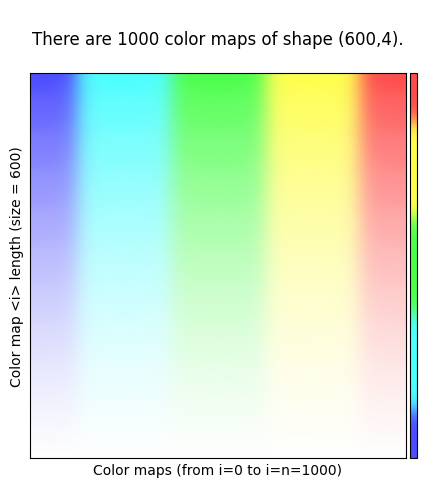
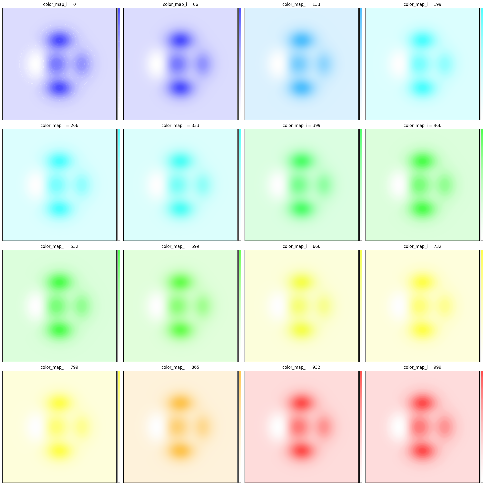
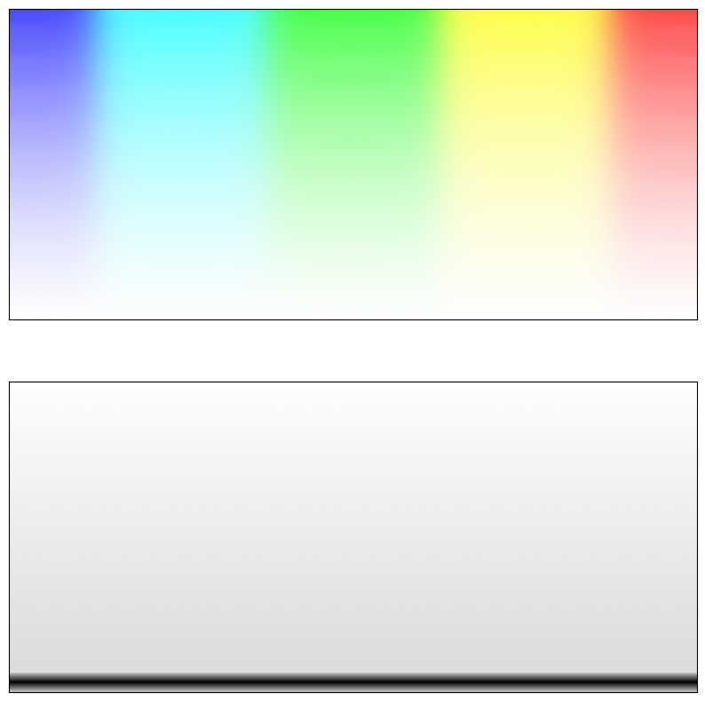

# ReBaD set of colormaps

## 📄 Description
The method presented here has been developed to enhance the representation of Fast Ripples (FR) in time-frequency space (scalograms). This method is called ReBaD for "Referential Based Delineated" colormaps. It is divided into two parts.

The first part is based on Shepard's inverse distance, with the aim of coloring portions of high relative magnitude in the image. The magnitude within each scalogram is compared to a reference obtained by calculating the scalograms of thousunds FR recorded on hybrid (macro/micro) intracerebal EEG (iEEG) of drug resistant epileptic patients. The higher the magnitude of an event compared to this reference, the warmer its color.

The second part consists in creating a delimitation between the "useful" parts of the signal, i.e. those with oscillations strongly represented in the frequency bands of interest, and the "inactive" parts, i.e. those where the frequency distribution is rather homogeneous.

## ⚒️ Installation

### Prerequisites
- Python 3.11
- Python libraries
    ```sh
    pip install -r requiremetns_local.txt  # for PyQt6 GUI, and/or,
    pip install -r requiremetns_web.txt  # for Web GUI
    ```

## 📝 Usage

### ReBaD - Defining a set of colormaps
Generate a 3-dimensional space (shape = [cmap_length, n_cmaps, rgb]) containing _**`n`**_ color matrices. _**`n`**_ is the amount of colors chosen by the user. Here it will be five colors : blue, cyan, red, yellow and red.

Then (1) create a color map usable by matplotlib from the color matrices obtained using the previous definitions; (2) obtain the color bar of all the colors available in the 3-dimensional space of the color maps; (3) generate an image that we will use to illustrate the variation of the available colors on concreate examples.

#### Quick view of all the available color maps
```python
import numpy as np
import matplotlib.pyplot as plt
from mpl_toolkits.axes_grid1 import make_axes_locatable, axes_size
from matplotlib.colors import ListedColormap

from modules.colormaps import create_custom_colormatrix_3D, lerp
from modules.plot_utils import create_cmap, get_all_cmaps
from modules.interpolation import create_custom_colormatrix_2D
from modules.plots import show_all_available_colormaps, show_individual_example

print("\nStarting process. This operation might take a few seconds.\n")
ReBaD_color_matrix_upper = create_custom_colormatrix_3D(n_cmaps=1000, cmap_length=600)

all_colormaps = get_all_cmaps(ReBaD_color_matrix_upper)
show_all_available_colormaps(ReBaD_color_matrix_upper, all_colormaps)
```


#### Application on some examples
Apply a linear variation of _**`w`**_ to pick a color map in the 3D color matrix.

```python
fig, axes = plt.subplots(4, 4, figsize=(20, 20))
color_map_indices = np.linspace(0, 999, 16, dtype=int)

for ax, color_map_i in zip(axes.flat, color_map_indices):
    color_map = ListedColormap(ReBaD_color_matrix_upper[:, color_map_i, :][::-1])
    show_individual_example(color_map, ax)
    ax.set_title(f'color_map_i = {color_map_i}')

plt.tight_layout()
plt.show()
```



#### Combine two colormaps: one for low-mid power, the other for high power
Generate a customizable color matrix in 2 dimensions (shape = [cmap_length, rgb]). This color matrix can be concatenated with an _**`i`**_ color matrix of the 3 dimensional space defined previously. The assembly of these color matrices allows to create the delineation and the "transparency" effect around the high intensity pixels of the image.

```python
# Create a custom color matrix
colormatrix = create_custom_colormatrix_2D(cmap_length=600)

# Duplicate the color matrix to create the lower half of the 3D color matrix
ReBaD_color_matrix_lower = np.tile(colormatrix, (ReBaD_color_matrix_upper.shape[1], 1, 1))
ReBaD_color_matrix_lower = np.swapaxes(ReBaD_color_matrix_lower, 0, 1)
ReBaD_color_matrix_lower = np.rot90(ReBaD_color_matrix_lower, 2)

### Plot the two color matrices
ReBaD_color_matrix_upper = np.array(ReBaD_color_matrix_upper)
print(f"ReBaD_color_matrix_upper shape: {ReBaD_color_matrix_upper.shape}")
print(f"ReBaD_color_matrix_lower shape: {ReBaD_color_matrix_lower.shape}")

### Create figure
f, ax = plt.subplots(nrows=2, figsize= (10,10))

### Plot 3D color matrix
ax[0].imshow(ReBaD_color_matrix_upper, cmap = all_colormaps, alpha = 0.7, 
           interpolation = 'bilinear', aspect = "auto")
ax[0].set_yticks([])
ax[0].set_xticks([])

### Plot 2D color matrix
ax[1].imshow(ReBaD_color_matrix_lower,aspect="auto",cmap=color_map)
ax[1].set_yticks([])
ax[1].set_xticks([])
```



#### Combine the two colormaps in a unique RGBA matrix
```python
ReBaD_color_matrix_full = []  #combined_color_matrices
ReBaD_color_maps_list = []  #combined_color_maps

for i, w in enumerate(np.arange(0,ReBaD_color_matrix_upper.shape[1])):

    cmatrix_dict = {"r": ReBaD_color_matrix_upper[:, w, :][::-1][:, 0],
                    "g": ReBaD_color_matrix_upper[:, w, :][::-1][:, 1],
                    "b": ReBaD_color_matrix_upper[:, w, :][::-1][:, 2]}
    color_matrix, color_map = create_cmap(cmatrix_dict, combine_two_cmaps=True)
    
    ReBaD_color_matrix_full.append(color_matrix)
    ReBaD_color_maps_list.append(color_map)
    
ReBaD_color_matrix_full = np.array(ReBaD_color_matrix_full)
ReBaD_color_maps_array = np.array(ReBaD_color_maps_list)

print(f"color matrix shape: {ReBaD_color_matrix_full.shape}.")
print(f"corresponding to {ReBaD_color_matrix_full.shape[0]} color maps of length {ReBaD_color_matrix_full.shape[1]}.")        
```

#### Application on some examples 
```python
fig, axes = plt.subplots(4, 4, figsize=(20, 20))

indices = np.linspace(0, ReBaD_color_matrix_full.shape[0] - 1, 16, dtype=int)

for i, w in enumerate(indices):
    row, col = divmod(i, 4)
    show_individual_example(ReBaD_color_maps_list[w], axes[row, col])
    if row == 3 and col == 3:
        break

plt.tight_layout()
plt.show()        
```



## 👤 Author
- LinkedIn: [Ludovic Gardy](https://www.linkedin.com/in/ludovic-gardy/)
- Doctoral thesis: [PDF](http://thesesups.ups-tlse.fr/5164/1/2021TOU30190.pdf)